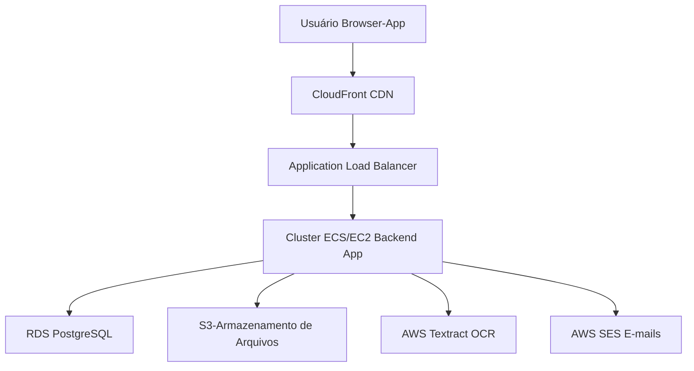
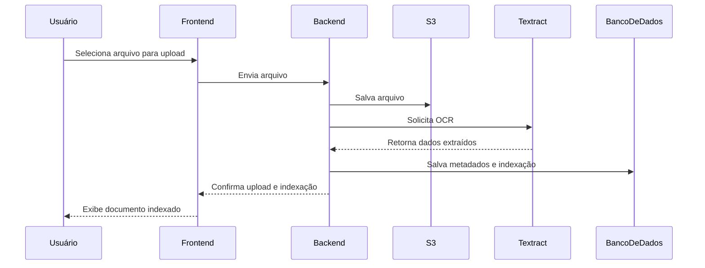
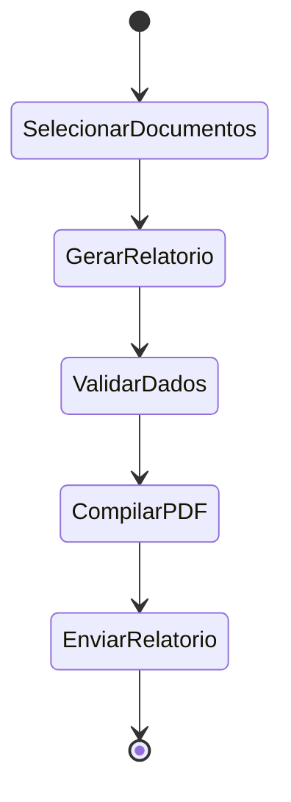
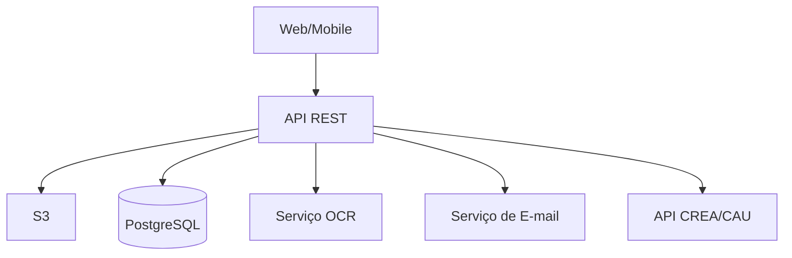

# **Plano de Negócios Completo: AcervoTech**

**Nome Provisório do SaaS:** AcervoTech
**Slogan:** Seu legado técnico, organizado e acessível.

## **Sumário Executivo**

O setor de engenharia e arquitetura no Brasil, embora tecnicamente avançado em suas práticas de projeto e execução, ainda enfrenta um desafio anacrônico e de alto risco: a gestão de seu acervo técnico. Atestados de Capacidade Técnica, Anotações/Registros de Responsabilidade Técnica (ARTs/RRTs), projetos, laudos e certificados são o lastro da carreira de um profissional e o principal ativo de uma empresa do setor. No entanto, esses documentos vitais são frequentemente gerenciados de forma descentralizada, em pastas físicas, HDs externos ou em sistemas de nuvem genéricos, resultando em desorganização, perda de dados, ineficiência e, crucialmente, perda de oportunidades de negócio e riscos de compliance.

O **AcervoTech** surge como a solução definitiva para este problema. Trata-se de uma plataforma SaaS (Software as a Service) verticalizada, projetada especificamente para as necessidades de engenheiros, arquitetos e empresas do setor. Nossa missão é transformar a gestão de acervo técnico de um fardo operacional em um ativo estratégico. Através de uma interface intuitiva, o AcervoTech oferecerá digitalização, armazenamento seguro em nuvem com criptografia de ponta, uma ferramenta de busca inteligente com OCR (Reconhecimento Óptico de Caracteres), automação de processos como alertas de vencimento, e a geração de relatórios customizados para licitações e comprovação de experiência.

Nosso modelo de negócio é baseado em assinaturas mensais ou anuais, com planos segmentados para atender desde o profissional autônomo até grandes corporações de engenharia. A estratégia de go-to-market combinará marketing de conteúdo focado nas dores do público, parcerias estratégicas com entidades de classe como CREA e CAU, e um processo de vendas diretas para contas empresariais.

As projeções financeiras, baseadas em cenários conservador e otimista, indicam um potencial de atingir o ponto de equilíbrio em 24 meses e um crescimento exponencial a partir do terceiro ano, capturando uma fração de um mercado vasto e carente de soluções especializadas. O AcervoTech não é apenas um "guarda-documentos" digital; é uma ferramenta de produtividade, compliance e valorização profissional, posicionada para se tornar o padrão ouro na gestão de acervo técnico no Brasil e, futuramente, na América Latina.

---

## **1. O Problema**

A gestão do acervo técnico é uma dor latente e universal para profissionais e empresas de engenharia e arquitetura. A complexidade não reside apenas no volume, mas na criticidade e na necessidade de acesso rápido e organizado a esses documentos. Os principais desafios são:

* **Desorganização Crônica e Risco de Compliance:** A prática comum envolve uma mistura de documentos físicos arquivados em pastas, arquivos digitais espalhados por múltiplos computadores, HDs externos e contas genéricas de armazenamento em nuvem (Google Drive, Dropbox). Essa fragmentação leva à dificuldade de localização, inconsistência de versões e risco de não conseguir comprovar experiência técnica em tempo hábil. Para uma empresa, a saída de um funcionário pode significar a perda de conhecimento sobre a localização e contexto do acervo, mesmo que os arquivos ainda existam.
* **Dificuldade de Acesso e Busca Ineficiente:** Encontrar um atestado específico emitido há cinco anos para uma nova licitação pode se tornar uma caça ao tesouro de horas ou dias. A busca é manual, baseada na memória ou em sistemas de nomeação de arquivos inconsistentes. Não há como realizar buscas complexas, como "encontrar todas as ARTs de obras de saneamento acima de R$500.000,00 executadas no estado de São Paulo".
* **Risco de Compliance e Perda de Oportunidades:** O sucesso em licitações públicas ou a qualificação para grandes projetos privados depende da comprovação rápida e precisa da capacidade técnica. A incapacidade de apresentar os documentos corretos, organizados e dentro do prazo resulta na desqualificação e na perda de receita. Além disso, a não renovação de certificados, anuidades do CREA/CAU ou certidões por esquecimento pode levar a multas, bloqueio de participação em licitações e até à impossibilidade de exercer a profissão. Alertas automáticos para esses vencimentos são essenciais para evitar riscos financeiros e reputacionais.
* **Ineficiência Operacional e Custo Oculto:** O tempo gasto por profissionais altamente qualificados (e caros) para procurar, organizar e compilar documentos é um custo operacional significativo e raramente medido. Esse tempo poderia ser investido em atividades que geram receita, como o desenvolvimento de novos projetos ou a prospecção de clientes.
* **Segurança e Colaboração Precárias:** Compartilhar documentos técnicos sensíveis por e-mail ou links públicos de serviços genéricos representa um risco de segurança. Não há controle de versão, rastreabilidade de acesso ou permissões granulares, o que dificulta a colaboração segura com parceiros, clientes ou para fins de auditoria.

---

## **2. A Solução: AcervoTech**

O AcervoTech é uma plataforma centralizada e inteligente que ataca diretamente as dores descritas, transformando a gestão de acervo de reativa e caótica para proativa e estratégica.

Nossa **proposta de valor** é simples: **Organize, Encontre e Utilize seu acervo técnico em segundos, não em horas.**

### **Funcionalidades Chave:**

* **Cadastro de Usuário e Autenticação:** Processo simples de criação de conta, login seguro e recuperação de senha.
* **Upload Seguro de Documentos:** Upload fácil de documentos (PDF, DWG, JPG, etc.) via web ou aplicativo mobile. Os documentos são armazenados na nuvem em servidores de alta disponibilidade e segurança, eliminando o risco de perda física.
* **Upload de Edital com Análise por IA:** O usuário pode fazer upload do edital da licitação (PDF ou DOC), e o sistema utiliza inteligência artificial para analisar automaticamente as exigências do documento. Com base nessa análise, o software sugere os atestados e documentos do acervo que melhor atendem aos critérios, facilitando a montagem do dossiê. O usuário pode revisar e escolher quais documentos utilizar, otimizando o processo e reduzindo riscos de erro ou omissão.
* **Digitalização e Armazenamento Centralizado:** Upload fácil de documentos (PDF, DWG, JPG, etc.) via web ou aplicativo mobile. Os documentos são armazenados na nuvem em servidores de alta disponibilidade e segurança, eliminando o risco de perda física.
* **Tecnologia OCR e Indexação Inteligente:** No momento do upload, nossa tecnologia de Reconhecimento Óptico de Caracteres (OCR) "lê" o conteúdo de documentos escaneados, como ARTs e atestados. Ele extrai automaticamente dados cruciais como número do documento, data, contratante, valor da obra e palavras-chave.
* **Busca Semântica e Filtros Avançados:** O usuário pode realizar buscas que vão além do nome do arquivo. Exemplos:
  * `"Atestados de capacidade técnica em estruturas metálicas"`
  * `"Todas as RRTs do arquiteto João Silva em 2023"`
  * `"Projetos com área construída > 1000m² para o cliente XYZ"`
* **Alertas e Notificações Automatizadas:** O sistema monitora as datas de validade de todos os documentos cadastrados (certificados, licenças, anuidades CREA/CAU) e envia alertas automáticos por e-mail e notificação push, evitando perdas de prazo e multas.
* **Relatório/Dossiê de Atestados para Licitações:** O sistema permite ao usuário inserir as exigências do edital (ex: tipo de obra, valor mínimo, pontuação, campos obrigatórios) e, automaticamente, sugere os atestados que atendem a esses critérios. O cliente pode então selecionar quais atestados utilizar, e o software gera um "quadro resumo" customizado com todos os dados relevantes (pontuação, dados exigidos, etc.), pronto para exportação em PDF ou Excel. A personalização do layout e dos campos do quadro é feita conforme o edital, agregando muito valor ao processo de licitação e aumentando a competitividade do cliente.
* **Gestão de Espaço de Armazenamento e Separação de Acervo:** O sistema permite o controle do espaço utilizado, com alertas de proximidade do limite do plano contratado, e separa claramente o acervo de cada profissional do acervo da empresa, garantindo organização, privacidade e compliance para ambos os contextos.
* **Gestão de CAT (Certidão de Acervo Técnico):** Um módulo específico para acompanhar o status da solicitação da CAT junto ao CREA/CAU, vinculando todas as ARTs/RRTs correspondentes.
* **Integração com Órgãos Reguladores (Visão de Futuro):** Em fases futuras, planejamos desenvolver APIs para se conectar diretamente aos sistemas do CREA/CAU (quando disponível), permitindo a importação automática de ARTs/RRTs registradas, garantindo que o acervo esteja sempre 100% atualizado.
* **Segurança e Controle de Acesso:** Criptografia de ponta (AES-256) para dados em repouso e em trânsito. O administrador da conta pode definir permissões granulares (visualizar, baixar, editar) por usuário ou por projeto, além de gerar links de compartilhamento seguros e com prazo de validade.

### Diagrama de Fluxo: Jornada do Usuário (Antes vs. Depois)

```mermaid
flowchart TD
  subgraph Antes do AcervoTech
    A1[Necessidade de Atestado] --> A2[Procurar em pastas físicas]
    A2 --> A3[Procurar em HDs]
    A3 --> A4[Pedir por e-mail a ex-colegas]
    A4 --> A5[Leva 4 horas]
    A5 --> A6[Encontra o documento errado]
    A6 --> A7[Repete o processo]
    A7 --> A8[Risco de perder o prazo da licitação]
  end
  subgraph Com AcervoTech
    B1[Necessidade de Atestado] --> B2[Acessa o AcervoTech]
    B2 --> B3[Digita na busca: Atestado obra de saneamento cliente ABC]
    B3 --> B4[Resultado instantâneo]
    B4 --> B5[Baixa o PDF ou gera link de compartilhamento]
    B5 --> B6[Leva 30 segundos]
    B6 --> B7[Foco na proposta técnica da licitação]
  end
```

---

## **3. Diferenciais Competitivos**
* **IA aplicada à análise de editais:** O AcervoTech inova ao permitir o upload do edital e análise automática por IA, sugerindo os melhores atestados do acervo para cada caso. Isso reduz drasticamente o tempo de preparação para licitações e aumenta a assertividade das propostas.

O mercado possui soluções genéricas, mas o AcervoTech se destaca por ser uma ferramenta especialista, construída com foco cirúrgico nas necessidades do seu público.

* **Verticalização e Foco no Nicho:** Não somos um Google Drive com mais pastas. Toda a taxonomia, os fluxos de trabalho e a terminologia da plataforma são desenhados para engenheiros e arquitetos. Entendemos o que é uma ART, uma CAT e uma RRT, e o sistema reflete essa especialização.
* **Usabilidade e Experiência do Usuário (UX/UI):** A interface será limpa, intuitiva e direta. Profissionais técnicos valorizam a eficiência. A curva de aprendizado será mínima, permitindo que o valor seja percebido desde o primeiro acesso.
* **Automação Inteligente:** Nosso principal diferencial tecnológico é a automação via OCR e a IA para categorização e busca. Isso economiza centenas de horas de trabalho manual por ano para nossos clientes, justificando o investimento.
* **Mitigação de Riscos do Free Trial:** O período de teste gratuito será cuidadosamente monitorado para evitar uso abusivo, com limites claros de armazenamento e funcionalidades, e comunicação transparente sobre a transição para o plano pago.
* **Atenção à Concorrência:** O mercado de soluções de armazenamento e gestão documental é altamente competitivo, com grandes players globais e soluções locais. O AcervoTech se diferencia pelo foco no nicho, mas mantém vigilância constante sobre movimentos de concorrentes e adapta rapidamente sua proposta de valor.
* **Segurança e Conformidade com a LGPD:** Tratamos os documentos dos nossos clientes como nosso ativo mais precioso. Além da segurança técnica, a plataforma será 100% aderente à Lei Geral de Proteção de Dados (LGPD), um fator crucial para empresas que lidam com contratos e dados de clientes.
* **Escalabilidade e Personalização:** A arquitetura do sistema permitirá atender desde um arquiteto autônomo com dezenas de documentos até uma construtora multinacional com centenas de milhares de registros, oferecendo planos e funcionalidades que se adaptam a cada perfil.

---

## **4. Público-Alvo**

Nosso mercado é vasto e claramente segmentado. Atuaremos em três frentes principais:

| Segmento de Mercado | Dores Principais | Como o AcervoTech Ajuda |
| :--- | :--- | :--- |
| **Profissionais Autônomos** (Engenheiros Civis, Eletricistas, Arquitetos, etc.) | Organização pessoal, medo de perder documentos, comprovação de experiência para novos clientes, controle de anuidades e certificados. | Plano acessível, acesso mobile, segurança, alertas automáticos. Valorização da sua marca pessoal. |
| **Pequenos e Médios Escritórios** (de 2 a 30 profissionais) | Padronização do acervo da empresa, colaboração em projetos, controle de acesso, perda de conhecimento quando um funcionário sai. | Gestão de múltiplos usuários, permissões, relatórios consolidados da empresa, centralização do ativo intelectual. |
| **Grandes Empresas** (Engenharia, Construção, Consultoria) | Gestão de um volume massivo de documentos, compliance e auditoria, preparação para grandes licitações, integração com sistemas internos (ERP, BI). | Plano Enterprise com segurança reforçada, suporte dedicado, API para integrações, relatórios avançados e audit trail completo. |

Estima-se que o Brasil possua mais de 1 milhão de engenheiros registrados e mais de 200 mil arquitetos e urbanistas. Mesmo capturando uma pequena fração deste mercado, o potencial de receita é imenso.

---

## **5. Modelo de Monetização (SaaS)**

Adotaremos um modelo de receita recorrente baseado em assinaturas, que garante previsibilidade de faturamento e constrói um relacionamento de longo prazo com o cliente.

### **Planos de Assinatura:**

| Característica | **Plano Profissional** | **Plano Equipe** | **Plano Enterprise** |
| :--- | :--- | :--- | :--- |
| **Ideal para** | Autônomos e Freelancers | Pequenos e Médios Escritórios | Grandes Empresas e Corporações |
| **Preço Estimado** | **R$ 49/mês** (ou R$ 490/ano) | **R$ 199/mês** (ou R$ 1.990/ano) | **Sob Consulta** |
| **Usuários Incluídos** | 1 | 5 (usuário adicional: R$ 25/mês) | Ilimitado (negociação customizada) |
| **Armazenamento** | 50 GB | 250 GB | Ilimitado |
| **Digitalização com OCR** | 100 páginas/mês | 500 páginas/mês | Ilimitado |
| **Alertas de Vencimento e Certidões** | ✔️ | ✔️ | ✔️ |
| **Separação de Acervo Profissional/Empresa** | ✔️ | ✔️ | ✔️ |
| **Busca Inteligente** | ✔️ | ✔️ | ✔️ |
| **Alertas de Vencimento** | ✔️ | ✔️ | ✔️ |
| **Relatórios Básicos** | ✔️ | ✔️ | ✔️ |
| **Gestão de Equipe** | ❌ | ✔️ | ✔️ |
| **Relatórios Avançados**| ❌ | ✔️ | ✔️ |
| **API para Integração** | ❌ | ❌ | ✔️ |
| **Suporte Prioritário**| E-mail | E-mail e Chat | Dedicado (Gerente de Conta) |
| **Segurança Avançada (SSO)** | ❌ | ❌ | ✔️ |

* **Free Trial:** Ofereceremos um período de teste gratuito de 14 dias para os planos Profissional e Equipe, sem necessidade de cartão de crédito, para reduzir a barreira de entrada e permitir que o usuário experimente o valor da ferramenta.

---

## **6. Estratégia de Marketing e Aquisição de Clientes**

Nossa estratégia será multifacetada, combinando abordagens de inbound e outbound para construir reconhecimento de marca e gerar um fluxo constante de leads qualificados.

* **Marketing de Conteúdo (Inbound):**
  * **Blog:** Artigos otimizados para SEO sobre temas como: "Guia completo para emitir sua CAT no CREA", "Os 5 erros mais comuns na gestão de acervo técnico", "Como usar seu acervo para ganhar mais licitações".
  * **Webinars:** Parcerias com especialistas do setor e influenciadores digitais (engenheiros e arquitetos com canais no YouTube/Instagram) para realizar webinars sobre temas relevantes, apresentando o AcervoTech como solução.
  * **Materiais Ricos:** E-books, templates de planilhas e checklists para download em troca de contato (geração de leads).

* **Marketing Digital (Performance):**
  * **Google Ads:** Campanhas focadas em palavras-chave de fundo de funil, como "software para ART", "gestão de acervo técnico online".
  * **LinkedIn Ads:** Segmentação precisa por cargo (Engenheiro Civil, Arquiteto Sênior), setor (Construção Civil) e tamanho da empresa. Ideal para alcançar os tomadores de decisão dos planos Equipe e Enterprise.

* **Parcerias Estratégicas:**
  * **Entidades de Classe:** Firmar convênios com conselhos regionais (CREA/CAU) e sindicatos (SINDUSCON) para oferecer descontos exclusivos aos seus associados. Esta é a estratégia de maior potencial de escala e credibilidade.
  * **Softwares Complementares:** Parcerias com empresas de software de orçamento de obras, gestão de projetos ou BIM para oferecer integrações e cross-promotion.

* **Vendas Diretas (Outbound):**
  * Uma equipe de vendas focada no segmento Enterprise, realizando prospecção ativa de grandes construtoras, concessionárias de serviços públicos e empresas de consultoria. O ciclo de vendas é mais longo, mas o valor do contrato (ACV) é muito maior.

### **Métricas Chave (KPIs):**

* **CAC (Custo de Aquisição de Cliente):** `(Investimento em Marketing + Vendas) / Nº de Novos Clientes`
* **LTV (Lifetime Value):** `(Ticket Médio Mensal × Margem Bruta) / Churn Rate`
* **Relação LTV/CAC:** Nosso objetivo é manter essa relação acima de 3, indicando um modelo de negócio saudável.
* **MRR (Receita Recorrente Mensal):** A métrica mais importante para um negócio SaaS.
* **Churn Rate (Taxa de Cancelamento):** Manter abaixo de 2% ao mês.

---

## **7. Análise de Concorrência**

O cenário competitivo é composto por players diretos e, mais perigosamente, indiretos.

| Concorrente | Tipo | Pontos Fortes | Pontos Fracos | Como nos Posicionamos |
| :--- | :--- | :--- | :--- | :--- |
| **Google Drive / Dropbox / OneDrive** | Indireto | Baixo custo (ou gratuito), familiaridade, integração com outras ferramentas do ecossistema. | Genérico, sem funcionalidades específicas, busca ineficiente para documentos técnicos, sem automação, segurança básica. | Somos a solução **especialista**. Nossa automação e inteligência oferecem um ROI claro ao economizar tempo e reduzir riscos. |
| **Grandes Players de Software de Engenharia** | Direto | Forte capacidade de investimento, integração com BIM e outros sistemas, presença internacional. | Alto custo, complexidade, pouca flexibilidade para pequenas empresas, suporte distante. | O AcervoTech oferece agilidade, adaptação local e foco total no acervo técnico, com integração planejada para BIM e relatórios customizáveis. |
| **Planilhas (Excel / Google Sheets)** | Indireto | Custo zero, altamente customizável. | Totalmente manual, propenso a erros, não escalável, sem segurança, sem alertas, visualização precária. | Somos a evolução natural da planilha. Oferecemos estrutura, segurança e automação que uma planilha jamais poderá entregar. |
| **Sistemas ERP Genéricos** | Indireto | Já implementado na empresa, centraliza muitas operações. | Módulos de gestão de documentos (GED) são caros, complexos e não especializados para acervo técnico. | Somos uma solução "best-of-breed" que pode se **integrar** ao ERP, cuidando da parte de acervo com maestria e enviando os dados necessários para o sistema principal. |
| **Pequenos Players Locais** | Direto | Podem ter um relacionamento inicial com clientes na sua região. | Geralmente possuem tecnologia defasada, pouca escalabilidade, UX pobre e falta de capital para inovação. | Superamos pela **tecnologia superior**, melhor experiência do usuário e uma estratégia de marketing e parcerias de nível nacional. |

### **Análise SWOT:**

* **Forças:** Solução de nicho, time experiente, foco em automação, modelo de negócio escalável.
* **Fraquezas:** Marca nova no mercado, necessidade de educar o cliente sobre o problema, ciclo de vendas potencialmente longo para contas Enterprise.
* **Oportunidades:** Mercado enorme e mal atendido, transformação digital acelerada no setor, possibilidade de expansão para outros países da América Latina.
* **Ameaças:** Entrada de um grande player de tecnologia no nicho, mudanças regulatórias abruptas do CREA/CAU, resistência cultural à adoção de novas tecnologias.
* **Ameaças Reforçadas:** O risco de grandes empresas globais ou soluções de engenharia ampliarem seu escopo para o nicho de acervo técnico é real. A diferenciação contínua, agilidade e proximidade com o cliente serão essenciais para manter a competitividade.

---

## **8. Plano Operacional**

A execução será dividida em fases claras, começando com um MVP para validar o core da nossa proposta de valor.

### **Desenvolvimento do MVP (Produto Mínimo Viável):**

O objetivo do MVP é ser lançado em 4-6 meses, focando nas funcionalidades essenciais que resolvem a dor mais aguda:

1. Cadastro de usuário e criação de conta.
2. Upload seguro de documentos (PDF, DOC, DWG).
3. Funcionalidade básica de OCR para extrair o número e data da ART/RRT.
4. Criação de tags e categorias manuais.
5. Busca simples por texto e tags.
6. Dashboard com visualização dos últimos documentos adicionados.

**Observação:** O MVP não incluirá inicialmente integração BIM, mas o roadmap prevê campo específico para informações BIM e geração de relatórios customizáveis conforme exigências de editais e clientes corporativos.

### **Stack Tecnológico Proposto:**

* **Frontend:** React ou Vue.js (frameworks modernos para interfaces ricas e reativas).
* **Backend:** Node.js (TypeScript) ou Python (Django/FastAPI) - excelentes para operações I/O e com vastos ecossistemas.
* **Banco de Dados:** PostgreSQL (robusto, confiável e com bom suporte a JSON para dados semi-estruturados).
* **Infraestrutura Cloud:** AWS (Amazon Web Services) - utilizando serviços como S3 para armazenamento, EC2/Lambda para computação, e RDS para o banco de dados. Oferece escalabilidade e segurança.
* **Serviço de OCR:** AWS Textract ou Google Vision AI.

### **Equipe Necessária (Fase Inicial):**

* **1x Product Manager / CEO:** (O Empreendedor)
* **1x Tech Lead / Arquiteto de Software:** (CTO)
* **2x Desenvolvedores Full-Stack:** Para construir o MVP.
* **1x UI/UX Designer (pode ser freelancer/parcial):** Para garantir uma experiência de uso impecável.
* **1x Especialista de Marketing/Conteúdo (parcial):** Para iniciar a estratégia de inbound.

### **Cronograma (Gantt Simplificado):**

* **Mês 1-2:** Design (UX/UI), Prototipagem, Validação com potenciais clientes.
* **Mês 2-5:** Desenvolvimento do MVP.
* **Mês 6:** Lançamento do Beta Fechado (para um grupo seleto de usuários).
* **Mês 7:** Lançamento Público Oficial e início das campanhas de marketing.
* **Pós-Lançamento:** Ciclos de desenvolvimento quinzenais (sprints) para adicionar novas funcionalidades baseadas no feedback dos usuários (alertas, relatórios, etc.).

### **Diagramas Técnicos:**

**Diagrama de Caso de Uso UML (Simplificado):**

* **Atores:** Engenheiro/Arquiteto, Administrador da Empresa.
* **Casos de Uso:**
  * `Fazer Login`
  * `Fazer Upload de Documento` (extends `Indexar com OCR`)
  * `Buscar Documento`
  * `Criar Relatório`
  * `Gerenciar Usuários` (Apenas Administrador)
  * `Receber Alerta de Vencimento`

**Diagrama de Arquitetura do Sistema (Simplificado):**

---

## 8.1 Diagramas UML Avançados

### Diagrama de Sequência: Upload e Indexação de Documento

### Diagrama de Atividades: Geração de Relatório para Licitação

### Diagrama de Componentes

---

## 8.2 Validação de Mercado

Para garantir o fit do produto com o mercado, serão adotados os seguintes métodos:

* **Entrevistas Qualitativas:** Realizar 20 entrevistas com engenheiros, arquitetos e gestores de empresas para mapear dores, validar funcionalidades e testar protótipos.
* **Landing Page de Pré-Cadastro:** Criar uma página simples apresentando o AcervoTech, com CTA para cadastro de interesse. Medir taxa de conversão e coletar feedback.
* **Prototipagem Rápida:** Desenvolver protótipos navegáveis (Figma) e realizar sessões de teste com potenciais usuários, coletando insights sobre UX/UI e funcionalidades.
* **Testes A/B:** Testar diferentes abordagens de comunicação, preços e funcionalidades para identificar o que gera maior engajamento.
* **MVP Funcional:** Lançar uma versão mínima do produto para um grupo restrito, monitorando uso real, engajamento e feedback.

---

## 8.3 Estratégias de Retenção e Sucesso do Cliente

* **Onboarding Guiado:** Fluxo de boas-vindas com tutoriais interativos, checklist de primeiros passos e suporte proativo.
* **Central de Ajuda e Suporte Multicanal:** Base de conhecimento, chat online, e-mail e WhatsApp para dúvidas e resolução rápida de problemas.
* **Programa de Sucesso do Cliente:** Acompanhamento personalizado para contas Equipe e Enterprise, com reuniões periódicas, análise de uso e sugestões de melhoria.
* **Feedback Contínuo:** Pesquisas NPS, coleta de sugestões dentro do app e canal aberto para melhorias.
* **Gamificação:** Badges, conquistas e recompensas para usuários engajados (ex: "Acervo 100% digitalizado").
* **Comunidade de Usuários:** Fórum online, webinars exclusivos e grupos de discussão para troca de experiências e networking.
* **Atualizações Constantes:** Lançamento regular de novas funcionalidades e melhorias, comunicadas via changelog e e-mail.

---

## 8.4 KPIs Operacionais

* **Engajamento:** Número de documentos indexados por usuário/mês, tempo médio para encontrar um documento, taxa de uso de busca avançada.
* **Onboarding:** Percentual de usuários que completam o onboarding em até 7 dias.
* **Retenção:** Taxa de usuários ativos mensalmente (MAU), churn de uso (usuários que deixam de usar, mesmo sem cancelar).
* **Sucesso do Cliente:** NPS (Net Promoter Score), tempo médio de resposta do suporte, taxa de resolução no primeiro contato.
* **Valor Entregue:** Redução média de tempo gasto em busca/organização de documentos, número de relatórios gerados por mês.
* **Adoção de Novas Funcionalidades:** Percentual de usuários que utilizam novas features lançadas.

---

## **9. Projeções Financeiras (3 Anos)**

As projeções são baseadas em premissas realistas, com dois cenários para análise de sensibilidade.

**Premissas Chave:**

* **Conversão Trial -> Pago:** 15%
* **Churn Mensal:** 3% no Ano 1, caindo para 1.5% no Ano 3.
* **Distribuição de Planos (Receita):** 60% Profissional, 35% Equipe, 5% Enterprise.
* **Ticket Médio Inicial (ARPA):** R$ 85,00
* **Custo da Equipe (4 pessoas):** R$ 60.000/mês
* **Custos de Infraestrutura:** Variável, estimado em 10% da receita.
* **Investimento em Marketing:** R$ 10.000/mês no Ano 1, crescendo 50% ao ano.

### **Cenário Conservador**

*Ano 1: Foco na aquisição orgânica e validação do produto.*
*Ano 2: Início da tração com parcerias.*
*Ano 3: Crescimento estável.*

| Métrica (Final do Período) | Ano 1 | Ano 2 | Ano 3 |
| :--- | :--- | :--- | :--- |
| **Clientes Pagantes** | 150 | 600 | 1.800 |
| **MRR (Receita Mensal Recorrente)** | R$ 12.750 | R$ 54.000 | R$ 171.000 |
| **Receita Anual** | R$ 90.000 | R$ 459.000 | R$ 1.548.000 |
| **Custos Totais Anuais** | R$ 850.000 | R$ 980.000 | R$ 1.340.000 |
| **Lucro/Prejuízo Anual** | **(R$ 760.000)** | **(R$ 521.000)** | **R$ 208.000** |
| **Ponto de Equilíbrio (Break-even)** | | Mês 30 | |

### **Cenário Otimista**

*Sucesso viral em campanhas, fechamento de grandes parcerias no Ano 1.*

| Métrica (Final do Período) | Ano 1 | Ano 2 | Ano 3 |
| :--- | :--- | :--- | :--- |
| **Clientes Pagantes** | 400 | 2.000 | 6.000 |
| **MRR (Receita Mensal Recorrente)** | R$ 34.000 | R$ 180.000 | R$ 570.000 |
| **Receita Anual** | R$ 240.000 | R$ 1.284.000 | R$ 4.500.000 |
| **Custos Totais Anuais** | R$ 870.000 | R$ 1.200.000 | R$ 2.000.000 |
| **Lucro/Prejuízo Anual** | **(R$ 630.000)** | **R$ 84.000** | **R$ 2.500.000** |
| **Ponto de Equilíbrio (Break-even)** | | Mês 22 | |

*Nota: Os custos iniciais refletem a necessidade de investimento em equipe e marketing antes da receita atingir a maturidade. O capital inicial (seed money) será crucial para cobrir o prejuízo dos primeiros ~24 meses.*

---

## **10. Riscos e Mitigações**

Um empreendedor experiente antecipa os obstáculos.

| Risco | Probabilidade | Impacto | Estratégia de Mitigação |
| :--- | :--- | :--- | :--- |
| **Baixa Adesão Inicial** | Média | Alto | Lançar um MVP focado na dor principal. Coletar feedback intensivamente. Implementar um programa de "Founding Members" com benefícios para os primeiros clientes. Forte estratégia de conteúdo para educar o mercado. |
| **Concorrência Agressiva** | Média | Média | Focar nos diferenciais (automação, UX). Construir uma marca forte e uma comunidade de usuários. Criar "moats" (fossos) através de efeitos de rede e custos de troca (quanto mais documentos no sistema, mais difícil sair). |
| **Vazamento de Dados / Falha de Segurança** | Baixa | Altíssimo | Investir pesado em segurança desde o Dia 1 (DevSecOps). Contratar auditorias de segurança externas (pentest). Ter um plano claro de resposta a incidentes. Seguro de responsabilidade cibernética. |
| **Questões Regulatórias** | Baixa | Média | Manter um canal de comunicação ativo com CREA/CAU. Construir uma arquitetura de software flexível para se adaptar a novas regras ou formatos de documentos. |
| **Dificuldade em Levantar Capital** | Média | Alto | Ter um plano de negócios sólido (este documento). Construir um MVP funcional que demonstre tração inicial (mesmo que com poucos usuários). Apresentar um time fundador forte e complementar. |

---

## **11. Conclusão e Próximos Passos**

O AcervoTech não é apenas uma ideia de software; é uma resposta direta a uma necessidade crítica e mal atendida em um dos mercados mais importantes do Brasil. A transição da gestão de documentos físicos e digitais desorganizados para uma plataforma inteligente, segura e centralizada não é uma questão de "se", mas de "quando". O AcervoTech está posicionado para liderar essa transformação.

O potencial de mercado é vasto, o modelo de negócio SaaS é comprovadamente eficaz e escalável, e os diferenciais competitivos, especialmente a automação e o foco no nicho, nos dão uma vantagem estratégica clara. As projeções financeiras indicam que, com a execução correta e o investimento inicial para suportar a fase de crescimento, o AcervoTech pode se tornar um negócio altamente lucrativo e um padrão da indústria.

**Próximos Passos Imediatos:**

1. **Validação Final do Modelo:** Realizar mais 15-20 entrevistas aprofundadas com os perfis de público-alvo para refinar as funcionalidades do MVP e a estratégia de preços.
2. **Busca por Capital Semente (Seed Funding):** Utilizar este plano de negócios para abordar investidores-anjo e fundos de Venture Capital focados em SaaS B2B, buscando um aporte inicial para cobrir os custos do primeiro ano de operação.
3. **Montagem da Equipe Fundadora:** Contratar o Tech Lead e os desenvolvedores iniciais que compartilharão da visão e da cultura da empresa.
4. **Início do Desenvolvimento do MVP:** Colocar a primeira linha de código, dando vida à visão do AcervoTech.

O caminho é desafiador, mas a oportunidade de agregar um valor imenso a milhões de profissionais e empresas, construindo um negócio de grande porte, é clara e tangível. O AcervoTech está pronto para construir o futuro da gestão do legado técnico.
